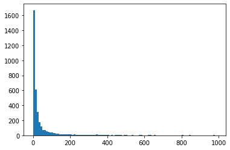

# Deep  Mushroom Spain

[](https://www.inaturalist.org/observations)
[](https://www.inaturalist.org/)
[](https://en.wikipedia.org/wiki/Residual_neural_network)
[](LICENSE)
[](https://github.com/Olament/DeepMushroom)

Deep Mushroom Spain is a fungal classification project focused on Spanish mushroom observations and inspired by the original [DeepMushroom repository](https://github.com/Olament/DeepMushroom).

This fork keeps the original idea as a reference point, but adapts the dataset workflow, project structure, and collection pipeline to support a cleaner Spain-focused training workflow.

## Original Repository

The original project that motivated this fork is:

- [Olament/DeepMushroom](https://github.com/Olament/DeepMushroom)

If you want to compare the initial layout, dataset assumptions, or earlier modeling approach, that repository is the right baseline.

## Repository Layout

Compared with the original repository, this project has already been re-structured around dataset lifecycle stages and execution concerns:

```text
data/
  raw/inaturalist/         # downloaded observation exports and raw API snapshots
  interim/                 # downloaded images and temporary working assets
  processed/               # model-ready training datasets
docs/
  assets/                  # figures used by the documentation
src/
  collection/              # data acquisition scripts
  training/                # model training entry points
tools/                     # one-off utilities and maintenance scripts
```

The goal of this re-structuration is to make the collection, preparation, and training stages easier to evolve independently than in the original repo layout.

## Data Sources

### iNaturalist.org

iNaturalist.org is a citizen science platform where users upload organism observations and the community helps identify them. In this fork, the working scope is Spanish mushroom observations between `2000-01-01` and `2026-03-30`.

The historical CSV exports are stored under `data/raw/inaturalist/`. The image download utility lives in `src/collection/download_images.go`, and the FastAI training entry point lives in `src/training/train_fastai.py`.

#### iNaturalist Exporter Query

This is the exporter query used to download Spanish fungal observations from `2000-01-01` to `2026-03-30`, restricted to the `species` rank and excluding the lichen class `Lecanoromycetes`:

```text
quality_grade=any&identifications=any&iconic_taxa[]=Fungi&place_id=6774&without_taxon_id=54743&rank=species&d1=2000-01-01&d2=2026-03-30
```

The key constraints in that exporter query are:

- `place_id=6774` limits results to Spain
- `rank=species` excludes genus-level and variety-level observations
- `without_taxon_id=54743` excludes `Lecanoromycetes`, which are the lichen class
- `iconic_taxa[]=Fungi` keeps the export within fungi

#### Using the iNaturalist API Instead of the Manual Export Page

Yes. The official observations API supports filtering by place, taxon, date range, and photo availability, so the website export page is not required for this workflow.

Relevant identifiers validated for this fork:

- `place_id=6774` for Spain
- `taxon_id=50814` for Agaricomycetes when you want a mushroom-oriented subset
- `taxon_id=47170` for all fungi if you want the broader fungal kingdom
- `taxon_id=54743` for `Lecanoromycetes`, which can be excluded in exporter-based workflows

Example API query for Spanish mushrooms in the requested date window:

```text
https://api.inaturalist.org/v1/observations?place_id=6774&taxon_id=50814&d1=2015-01-01&d2=2026-01-01&photos=true&verifiable=true&per_page=200
```

Notes:

- The API returns paginated JSON, not a CSV export.
- The public API is rate-limited. iNaturalist documents a hard cap of 100 requests per minute and asks clients to stay at 60 requests per minute or lower and under 10,000 requests per day.
- A broader fungi query with `taxon_id=47170` also works for Spain and the same date range.

#### CSV Fields

Not all of the current CSV columns are required for the image-only workflow.

The current downloader only needs a small subset of fields such as:

- `id`
- `image_url`
- `scientific_name`

The remaining fields are intentionally kept so the dataset can support future models that may use metadata beyond the image itself, such as location, coordinates, observation date, or other contextual signals.

#### Distribution



This distribution view is part of the original DeepMushroom line of work and should be read in the context of the original [Olament/DeepMushroom](https://github.com/Olament/DeepMushroom) project that inspired this fork.

The data distribution is heavily skewed toward a relatively small number of common species. Species with fewer than 10 images are removed for two reasons:

- A very small number of observations usually indicates that the species is not common enough to provide much practical value in the current identification workflow.
- There is not enough image data to train the classifier reliably, and those classes tend to reduce overall model quality.

### MushroomExpert.com

Since the images from MushroomExpert were identified by mycologists, they can be used as a reliable external validator when testing the performance of the model.

## Model

At this stage, the project still uses the [fast.ai](https://www.fast.ai/) library as the main experimentation layer. Over time, the training stack may move toward more custom models built directly on [PyTorch](https://pytorch.org/).

### Metrics

|     Architecture    | Validation Accuracy | Validation Top-5 Accuracy | Test Accurarcy | Test Top-5 Accuracy |
|:-------------------:|:-------------------:|:-------------------------:|:--------------:|:-------------------:|
|       ResNet34      |        70.68        |           86.36           |      31.94     |        48.11        |
|       ResNet50      |        79.67        |           91.76           |      38.77     |        59.14        |
| ResNet50+Focal Loss |        80.24        |           92.32           |      39.48     |        60.45        |

#### Top 10 Most Confused Fungal Species

|        Prediction        |       Ground Truth       |
|:------------------------:|:------------------------:|
|    Fomitopsis mounceae   |    Fomitopsis pinicola   |
|   Pleurotus pulmonarius  |    Pleurotus ostreatus   |
| Dacrymyces chrysospermus |   Tremella mesenterica   |
|   Tremella mesenterica   | Dacrymyces chrysospermus |
|  Laetiporus gilbertsonii |   Laetiporus sulphureus  |
|     Stereum hirsutum     |    Stereum complicatum   |
|     Tremella aurantia    |   Tremella mesenterica   |
|    Ganoderma megaloma    |   Ganoderma applanatum   |
|  Laetiporus cincinnatus  |   Laetiporus sulphureus  |
|   Ganoderma applanatum   |     Ganoderma brownii    |

## License

This repository is distributed under the GNU General Public License v3.0. See [LICENSE](LICENSE) for the full text.

## Acknowledgements

Thanks to [Olament](https://github.com/Olament), the owner of the original [DeepMushroom](https://github.com/Olament/DeepMushroom) repository, for creating such a strong reference project.

That work caught my eye when the Reddit bot was up and it became the clearest reference point for building this Spain-focused fork. I recall generating a small model for Spain back in the day but now I would like to make it serious.
